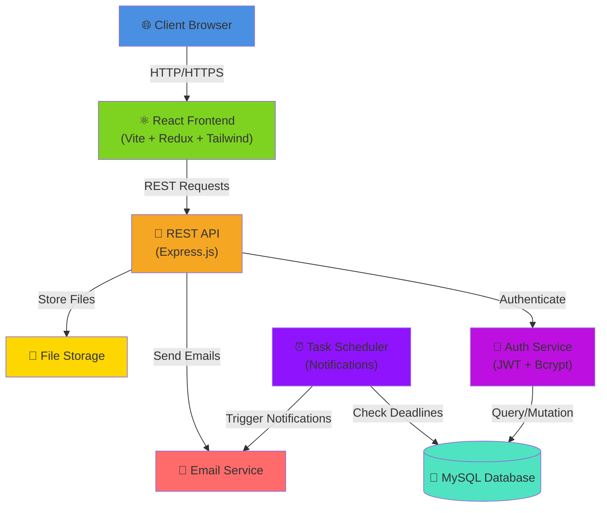
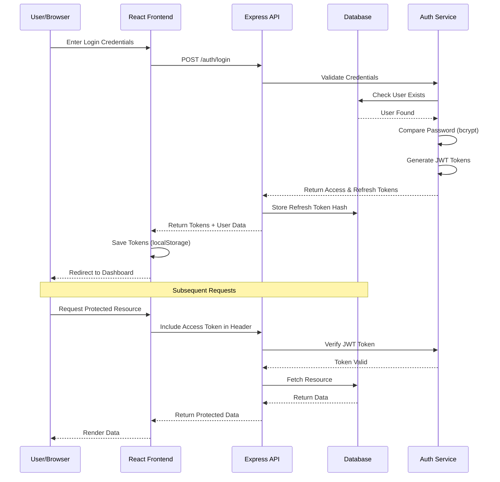
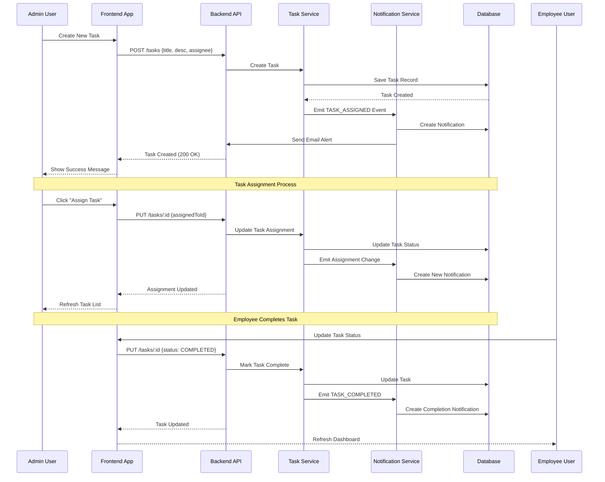
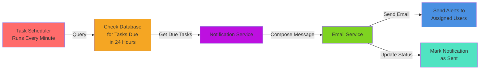
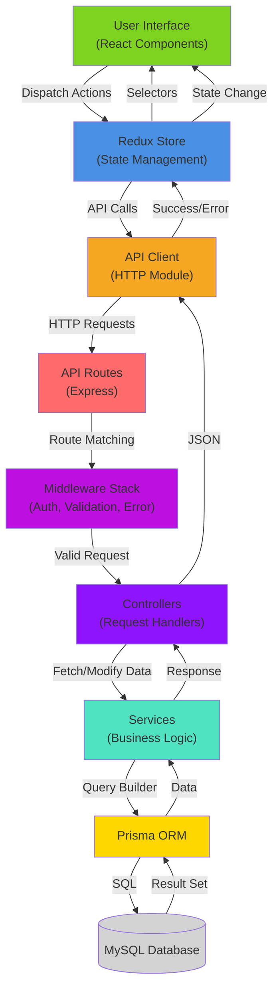
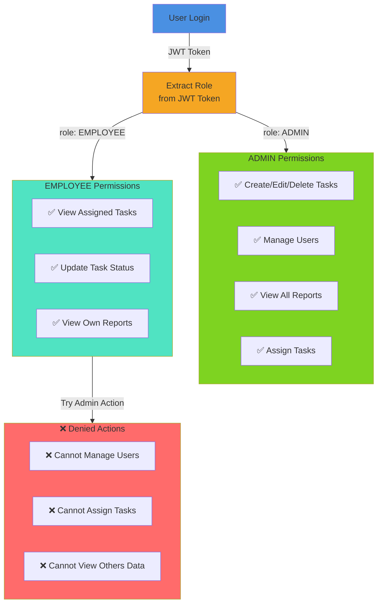
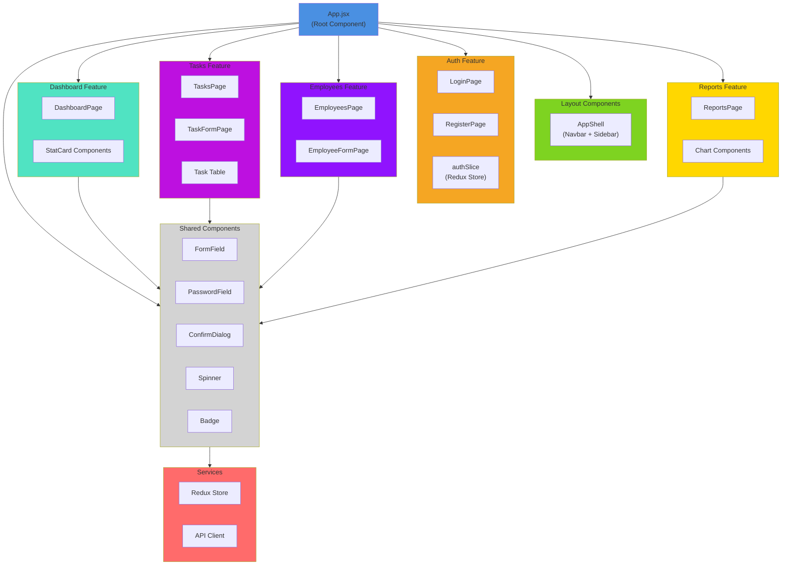

# Architecture & Flow Diagrams

## System Architecture Diagram

## Authentication Flow

## Task Management Flow

## Notification Scheduler Flow

## Data Flow Diagram

## User Role & Permission Flow

## Component Architecture

## Database Entity Relationship Diagram

```mermaid
erDiagram
    USER ||--o{ REFRESH_TOKEN : has
    USER ||--o{ TASK : "assigned"
    USER ||--o{ NOTIFICATION : receives
    TASK ||--o{ ATTACHMENT : contains
    TASK ||--o{ NOTIFICATION : triggers
    
    USER {
        string id PK
        string fullName
        string email UK
        string password
        enum role
        string department
        string designation
        datetime createdAt
        datetime updatedAt
    }
    
    REFRESH_TOKEN {
        string id PK
        string tokenHash UK
        string userId FK
        datetime createdAt
        datetime expiresAt
        datetime revokedAt
        string replacedByHash
        string ip
        string userAgent
        boolean rememberMe
    }
    
    TASK {
        string id PK
        string title
        text description
        enum priority
        enum status
        datetime startDate
        datetime dueDate
        string assignedToId FK
        datetime createdAt
        datetime updatedAt
    }
    
    ATTACHMENT {
        string id PK
        string fileName
        string fileUrl
        string fileType
        int fileSize
        string taskId FK "UK"
        datetime uploadedAt
    }
    
    NOTIFICATION {
        string id PK
        string userId FK
        string taskId FK "optional"
        enum type
        string title
        text message
        boolean isRead
        datetime createdAt
    }
```

---

## Legend

- 🌐 = Web/Network
- ⚛️ = React/Frontend
- 🔌 = API/Backend
- 🔐 = Security/Authentication
- 💾 = Database
- 📧 = Email Service
- 📁 = File Storage
- ⏰ = Scheduler/Time-based

